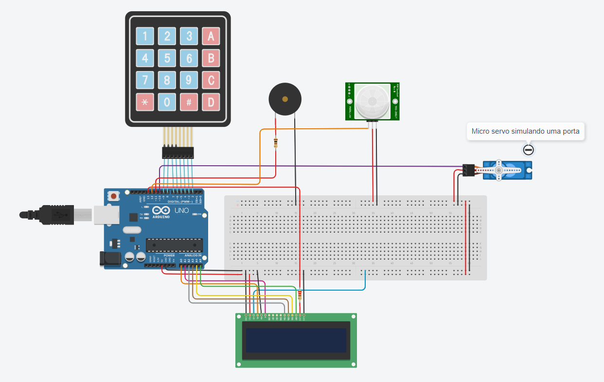

# Fechadura de uma porta controlada por senha

#### Objetivo

Simular a fechadura de uma porta controlada por senha usando teclado matricial, sensor de movimento e micro servo.

#### Componentes usados

- Teclado Matricial 4x4
- Arduino UNO R3
- Sensor PIR
- Micro servo
- Buzzer
- LCD 16x2

#### Diagrama

## Referências

[LCD 16x2](https://arduinogetstarted.com/tutorials/arduino-lcd)

[Micro servo](https://arduinogetstarted.com/tutorials/arduino-servo-motor )

[Teclado Matricial](https://arduinogetstarted.com/tutorials/arduino-keypad)

[Piezo Buzzer](https://arduinogetstarted.com/tutorials/arduino-piezo-buzzer)

[Door lock system using password](https://arduinogetstarted.com/tutorials/arduino-door-lock-system-using-password)

 